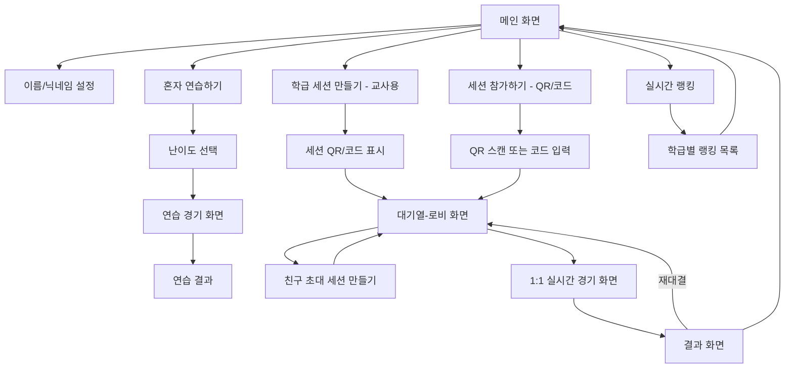
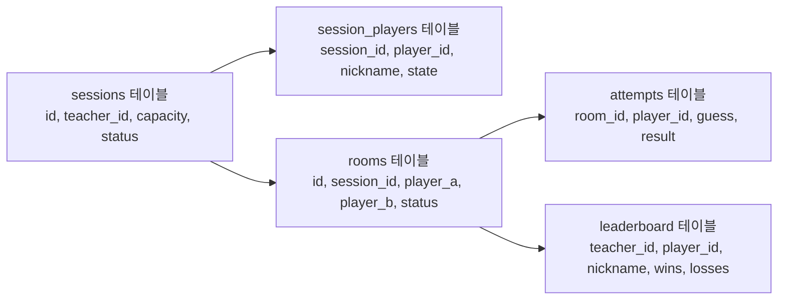

# 숫자야구 게임(Strike Four) 앱 PRD

Sep 22, 2026 · @Someone

## 개요 및 목표

어린 시절 쉬는 시간에 하던 숫자야구(볼·스트라이크·아웃)를 웹 앱으로 만든다. 별도 로그인 없이 PC와 스마트폰 브라우저에서 바로 즐길 수 있는 캐주얼 게임을 목표로 한다.

**핵심 가치**

- 진입 장벽 없음: 회원가입 없이 이름/닉네임만으로 바로 플레이
- 세 가지 플레이 방식: 혼자 컴퓨터(AI)와 대결 / 교사가 배포한 QR로 학급 친구들과 랜덤 매칭 대결 / QR로 특정 친구를 초대해 1:1 대결
- 가벼운 경쟁 요소: 학급(교사) 단위 리더보드로 승률·승리 기록을 겨룰 수 있음

**참고 자료**: 첨부된 '홈런 숫자야구' 스크린샷의 UI 흐름(메인 화면 구성, 타자 기록판, 숫자 키패드, 결과 모달, 대기 중인 공개방 리스트 등)을 참고해 화면 구조를 설계함

## 대상 사용자 및 사용 환경

**플랫폼**: 반응형 웹(PWA 수준). PC/크롬북(디벗)/스마트폰 브라우저 모두에서 동일한 기능을 제공하며, 별도 앱 설치 없이 브라우저 접속만으로 이용

**이용 방식**: 회원가입·로그인 없음
- 학생: 게임 진입 시 이름/닉네임을 입력하면, 브라우저 로컬스토리지에 저장되어 다음 방문 시 자동으로 불러옴 (기기를 바꾸거나 브라우저 데이터를 지우면 기록이 끊김 — 계정 개념이 아니므로 기기 간 동기화는 범위 밖)
- 교사: 최초로 세션을 만들 때 서버가 익명 teacher_id(uuid)를 발급해 로컬스토리지에 저장. 로그인은 없지만 이 teacher_id로 교사별 세션이 서로 구별되어, 같은 시간대에 여러 학급이 동시에 사용해도 매칭·리더보드가 서로 섞이지 않음

**주 사용자**

- 초등학교 교실 환경(쉬는 시간, 방과후 등)에서 크롬북(디벗)/전자칠판/PC로 이용하는 학생
- 교사가 배포한 학급 세션 QR을 스캔해 같은 반 친구와 랜덤으로 매칭되어 대전하는 학생
- 특정 친구를 QR로 직접 초대해 1:1 대전하는 학생

**접속 시나리오**

1. 교사가 교사용 PC에서 '학급 세션 만들기'를 누르면 해당 세션 전용 QR 코드 표시 (여러 학급이 동시에 사용해도 학급마다 별도 세션·QR로 분리됨)
2. 학생들이 각자 크롬북/스마트폰으로 QR을 스캔해 같은 세션에 입장 → 이름/닉네임 입력 후 대기열에 합류
3. 세션 내에서 서버가 대기 중인 학생을 2명씩 자동으로 랜덤 매칭해 실시간 대결 시작 (게임이 끝나면 원할 경우 다시 대기열로 돌아가 새 상대와 재대결 가능)
4. (선택) 특정 친구와만 대전하고 싶다면 학생이 대기열 화면에서 직접 '친구 초대' 세션(정원 2명)을 만들어 QR/코드를 그 친구에게만 공유
5. 혼자 연습하고 싶다면 세션 참여 없이 바로 '혼자 연습 모드' 진입 가능

## 게임 규칙

**기본 규칙**: 0\~9 중 서로 다른 숫자 4개로 이루어진 정답을 녹음에서 생성하고, 상대는 4자리 숫자를 추리해 입력함

**판정 기준**

- 숫자와 자릿수가 모두 일치 → 스트라이크(S)
- 숫자는 있지만 자릿수가 다름 → 볼(B)
- 정답에 없는 숫자 → 아웃(O)
- 4스트라이크(4S) → 홈런(정답 적중), 게임 종료

**시도 횟수**: 기본 10회(혼자 연습은 초등학생 눈높이를 고려해 10\~20회 사이에서 설정 가능). 소진 횟수 내에 맞추지 못하면 패배

**1:1 대전의 승패 판정**: 먼저 홈런을 맞힌 쪽이 승리. 둘 다 소진 횟수 내에 못 맞추면 무승부

**턴 제한 시간**(QR 1:1 실시간 모드): 한 턴당 30초 제한(초등학생 대상임을 고려해 첨부 이미지의 20초보다 여유 있게 조정). 시간 초과 시 턴 자동 넘김(개발 단계에서 확정)

## 기능 1. 혼자 연습하기 (vs AI)

캐주얼하게 혼자 감을 익힐 수 있는 기본 모드. 첨부 이미지의 '혼자 연습 모드' 화면 구성을 기본 참고

| 항목 | 내용 |
| --- | --- |
| 난이도 선택 | 쉼음 / 보통 / 어려움 3단계를 시작 전 선택 |
| 쉼음 | AI가 규칙에 맞는 숫자를 순수 랜덤으로 추출 |
| 보통 | 이전 S/B 힌트를 일부 반영해 후보를 생당히 좁혀가며 추출(가벼운 추론) |
| 어려움 | 가능한 후보를 체계적으로 좌힐리고(제약 전파) 최적의 수를 선택 — 사람처럼 즉각적으로 느껴지는 강한 상대 |

**플로우**

1. 난이도 선택 → 게임 시작, 입력 키패드로 4자리 숫자 입력
2. 내 공격(내가 입력 → S/B/O 판정)와 AI 추론 결과를 각각 기록판에 누적 표시(첨부 이미지의 '나의 공격 기록' 팔 참고)
3. 내가 먼저 홈런을 맞히면 승리 화면(첨부 이미지의 '연습 홈런' 화면) 표시, 시도 횟수 소진 시 실패 화면
4. 결과는 리더보드에 반영되지 않음(연습용이므로 승패 기록은 로컬에만 누적)

**비고**: 첨부 스크린샷의 '전적 12승 3패(승률 80%)' 표시는 QR 대전 전적만 집계하는 것으로 가정(연습 경기는 제외). 확인 필요

## 기능 2. QR 대전 (학급 세션 랜덤 매칭 / 친구 초대)

교실에서 여러 명이 동시에 즐길 수 있는 핵심 기능. "세션(Session)"이라는 하나의 구조로 두 가지 진입 방식을 모두 지원한다

**세션(Session) 공통 구조**

세션은 정원(capacity)과 소유자(owner)를 가진 대기 그룹이며, 정원 외에는 두 진입 방식이 동일한 매칭 로직을 공유한다

| 구분 | 학급 세션 모드 | 친구 초대 모드 |
| --- | --- | --- |
| 생성자 | 교사 | 학생(방장) |
| 정원 | N명(제한 없음) | 2명 |
| QR 공유 방식 | 교사 화면에 표시, 여러 학생이 스캔 | 방장이 특정 친구 1명에게만 공유 |
| 매칭 방식 | 대기열에서 서버가 2명씩 자동 랜덤 매칭 | 두 번째 사람이 입장하는 즉시 매칭 |
| 게임 종료 후 | 원하면 다시 대기열로 복귀해 재매칭 가능 | 필요 시 같은 상대와 재시작 |

**세션 생성 및 참가**

1. (교사) '학급 세션 만들기' 선택 → 정원 제한 없는 세션 생성 → 서버가 고유 세션 코드(6자리)와 QR 이미지를 화면에 표시
   (학생) 대기열 화면에서 상대 없이 기다리는 중 '친구 초대' 선택 → 정원 2명짜리 세션 생성 → QR/코드를 특정 친구에게 공유
2. 학생이 스마트폰/크롬북 카메라로 QR을 스캔 → 세션 코드가 포함된 URL로 접속 → 이름/닉네임 입력 후 대기열 합류
3. QR 스캔이 어려운 환경을 대비해 6자리 세션 코드 직접 입력 옵션도 함께 제공
4. 학급 세션은 대기열에 2명 이상 모이면 서버가 자동으로 랜덤 페어링해 게임 시작(별도 '준비 완료' 버튼 없음). 친구 초대 세션은 두 번째 사람이 입장하는 즉시 시작
5. 같은 시간대에 여러 교사가 각자 세션을 열어도, 매칭은 항상 같은 세션(같은 teacher_id) 안에서만 일어나므로 다른 학급 학생과는 섞이지 않음

**실시간 동기화**

- Supabase Realtime(Presence로 대기열 인원 추적, Broadcast로 공격 입력·판정 결과 즉시 동기화)을 통해 양쪽의 공격 입력과 판정 결과를 즉시 동기화
- 현재 차례(내 차례 / 상대 차례)를 화면 상단에 명확히 표시(첨부 이미지의 '내 차례' 표시 참고)
- 상대가 당괴 종료 · 재접속 시 처리: 20\~30초 대기 후 부재 판정, 남은 플레이어에게 부전승 부여(학급 세션의 경우 부전승 후 남은 플레이어는 자동으로 대기열에 복귀)

**게임 종료**: 먼저 홈런 → 승리 화면(첨부 이미지의 '연습 홈런!' 유사 구성) → 닉네임이 자동으로 전적에 반영되고 해당 세션(학급)의 리더보드 갱신. 학급 세션이면 두 학생 모두 원할 경우 대기열로 돌아가 재대결 가능

**해소된 질문**: 별도의 "공개방 대기실 목록"은 지원하지 않는다 — 학급 세션은 교사가 배포하는 QR/코드로만 입장하고, 입장 후 매칭은 서버가 자동으로 처리하므로 학생이 방을 골라서 들어가는 리스트 UI는 불필요

**남은 열린 질문**: 학급 세션에서 대기 인원이 홀수일 때 마지막 1명의 대기 처리(예: 짝이 생길 때까지 대기 안내, 또는 AI와 임시 연습 후 재편입) 방식은 개발 단계에서 결정

## 기능 3. 리더보드 / 랭킹 (학급 단위)

로그인 없이도 '우리 반 안에서 내 기록'이 이어지는 것처럼 보이게 하는 학급 단위 랭킹 기능

**식별 방식**: 브라우저에 저장된 이름/닉네임 + 서버 발급 익명 ID(uuid)를 짝으로 묶어 전적을 집계. 같은 기기·같은 브라우저에서는 기록이 이어지지만, 다른 기기로 접속하면 새 익명 사용자로 집계됨(로그인 미구현의 구조적 한계)

**집계 범위**: 리더보드는 전체 통합이 아니라 **교사(학급) 단위로 분리 집계**한다 — 같은 teacher_id가 만든 세션에 참여한 학생들끼리만 순위를 겨루며, 다른 반 학생과는 섞이지 않는다. (학생이 다른 교사의 세션에 참여하면 그 반에서는 별도의 새 기록으로 집계됨 — 로그인 미구현에 따른 구조적 한계)

**집계 대상**: QR 세션(학급 세션 모드 / 친구 초대 모드) 실시간 대전의 승패만 집계(혼자 연습 결과는 제외)

**표시 지표**

| 항목 | 설명 |
| --- | --- |
| 순위 | 승률 기준 내림차순(최소 대전 수 충족 시만 랭킹 진입, 예: 3전 이상) |
| 승-패 | 첨부 스크린샷과 동일하게 '12승 3패' 형태로 표시 |
| 승률 | 승리 수 / 총 대전 수 백분율 |
| 최소 시도 횟수 홈런 | 보너스 지표로 '최소 횟수 승리' 별도 순위도 고려 가능 |

**화면**: 메인 화면의 '실시간 랭킹' 버튼으로 진입(첨부 이미지 참고) — 내가 마지막으로 참여한 교사(학급)의 리더보드를 기본으로 보여줌. 상위 N명 리스트 + 내 순위 강조 표시

**열린 질문**: 기간(주간/월간/전체 누적) 구분이 필요한지, 부정 방지(연속 세션 생성으로 가짜 승리 쌓기 등)를 어느 수준까지 막을지 후속 논의 필요

## 기능 4. 테마 선택 (디자인 모드 전환)

사용자가 파스텔톤과 모던 클린 두 가지 디자인을 드롭다운에서 직접 선택하는 기능. 두 시안 모두 실제로 구현되며 언제든 전환 가능

**위치**: 메인 화면 상단(또는 설정 아이콘 내)의 드롭다운 박스

**선택지**

| 옵션 | 설명 |
| --- | --- |
| 파스텔톤 | 부드럽고 귀여운 톤, 초등학생 대상 기본 추천 테마 |
| 모던 클린 | 깔끔하고 모던한 톤 |

**동작 방식**

1. 드롭다운에서 테마를 선택하면 즉시 전체 화면에 적용(새로고침 불필요)
2. 선택한 테마는 브라우저 localStorage에 저장되어 다음 방문 시 자동 적용(닉네임과 동일한 방식)
3. 최초 방문자에게는 기본 테마(파스텔톤) 적용, 언제든 변경 가능

**구현 방식**: CSS 커스텀 속성(변수) 기반 테마 시스템. 최상위 요소에 `data-theme="pastel" | "modern"` 속성을 부여하고, 색상·폰트·라운드 등 토큰을 CSS 변수로 관리. 드롭다운 변경 시 JS로 해당 속성만 토글하므로 화면 전체 재렌더링 없이 즉시 반영 가능

**열린 질문**: QR 1:1 대전 시 두 플레이어가 서로 다른 테마를 사용해도 게임 로직에는 영향 없음(테마는 순수 UI 레이어) — 개발 단계에서 추가 확인 필요

## 화면 구성(IA) 및 사용자 흐름

**화면 목록**

| 화면 | 주요 요소 | 참고 |
| --- | --- | --- |
| 메인 | 이름(닉네임)/전적, 혼자 연습·학급 세션 만들기(교사용)·세션 참가하기·랭킹 버튼 | 첨부 1번 이미지 |
| 연습 경기 | 내 공격 기록판, 최근 타격 결과, 숫자 키패드 | 첨부 2번 이미지 |
| 세션 대기열(로비) | 대기 인원 수, 매칭 중 안내, 친구 초대 버튼 | 신규 설계 필요 |
| 1:1 실시간 경기 | 양쪽 공격 기록판, 턴 오버 타이머, 상대 상태 | 첨부 3번 이미지 |
| 결과 | 승리/패배 안내, 상대 정답, 시도 횟수, 다시하기/재대결 | 첨부 4번 이미지 |
| 실시간 랭킹 | 학급(교사) 단위 순위 테이블, 내 순위 강조 | 신규 설계 필요 |

메인 화면 상단에는 테마 선택 드롭다운(파스텔톤/모던 클린)이 추가된다

## 기술 스택 및 아키텍처 제안

**바닐라 JS 단일 HTML + GitHub Pages + Supabase** 조합을 기본으로 제안함. 별도 Node.js/Socket.io 서버 없이 Supabase Realtime으로 매칭·실시간 동기화를 모두 처리한다

| 영역 | 선택 | 이유 |
| --- | --- | --- |
| 프론트엔드 | Vanilla JS 단일 HTML(또는 페이지별 분리) | 기존 개발 방식과 일관성, 배포 단순 |
| 배포(프론트) | GitHub Pages | 무료 정적 호스팅, 기존 파이프라인과 동일 |
| 백엔드/DB | Supabase(Postgres, Free Tier) | 별도 API·WebSocket 서버 없이 DB와 실시간 기능을 함께 제공. SQL 기반이라 리더보드 승률 정렬·집계가 자연스러움 |
| 실시간 동기화 | Supabase Realtime — Presence(세션별 대기 인원 추적) + Broadcast(공격 입력·판정 결과 즉시 전달) | 세션 매칭과 턴 동기화를 위한 별도 WebSocket 서버(Node.js/Socket.io) 없이 구현 가능 |
| 데이터 저장 | Supabase Postgres(Free Tier) | sessions(세션), session_players(세션 참가자), rooms(1:1 대전방), attempts(공격 기록), leaderboard(학급별 전적)를 테이블로 저장 |
| 사용자 식별 | 브라우저 localStorage(uuid + 이름/닉네임), 교사도 동일 패턴으로 teacher_id 발급 | 로그인 없이 '내 기록' 개념 구현, 교사별 세션 구분 |
| QR 생성 | qrcode.js 등 경량 라이브러리(CDN) | 세션 URL을 QR로 변환, 별도 서버 호출 없이 클라이언트에서 처리 가능 |

**간이 ERD**

**리스크 요소**: Supabase Free Tier는 계정당 **활성 프로젝트 2개 제한**이 있어, 기존에 운영 중인 다른 프로젝트와 겹치면 사용 시간 동안 하나를 일시정지해야 할 수 있음(확인 결과 운영상 문제 없음으로 확정). 또한 1주일 이상 미접속 시 프로젝트가 자동 일시정지되므로, 방학 등 장기 미사용 기간 후에는 재활성화가 필요할 수 있음

## 비기능 요구사항

- **반응형**: 360px(스마트폰)부터 1920px(PC)까지 깨짐 없이 동작. 키패드 입력은 터치와 물리 키보드 입력 모두 지원
- **성능**: 공격 입력 후 상대에게 결과가 반영되는 데 1초 이내 목표(학교 와이파이 환경 기준)
- **예외처리**: 상대가 이탈·재접속하는 경우, 네트워크가 끊기는 경우에 대한 처리 플로우 필요(재접속 안내, 부전승 처리)
- **동시접속**: 한 교실에서 여러 쌍이 동시에 대전해도 방이 분리되어 서로 영향을 받지 않아야 함
- **링크 구조**: 방 코드가 URL에 노출되므로 추측 어려운 충분한 길이(예: 6자리 이상)로 설계하고, 사용 후 방은 만료 처리(예: 1시간)하여 DB 누적 방지

## 향후 확장 아이디어 및 열린 질문

**확장 아이디어(버전 2 이후)**

- 반 전체가 참가하는 토너먼트/리그전
- 교사용 모니터 화면(리더보드 대형 화면로 전자칠판에 홈사이트)
- 난이도별 랭킹 분리

**해소된 질문**: 공개방 대기실 목록은 지원하지 않음(학급 세션 QR/코드 입장 후 서버 자동 매칭으로 대체) — "기능 2. QR 대전" 섹션 참고

**이번 PRD에서 아직 열려있는 질문**

1. 학급 세션 대기 인원이 홀수일 때 마지막 1명의 처리 방식
2. 리더보드 집계 기간(전체 누적 vs 주간/월간 리셋)
3. 닉네임 중복·부적절어 필터링 수준
4. 혼자 연습 승패도 리더보드에 반영할지 여부
